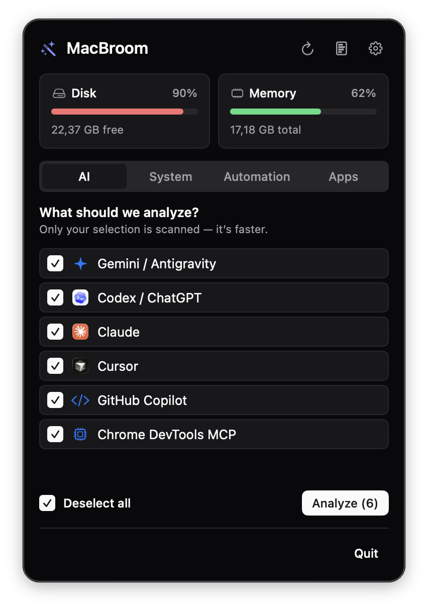
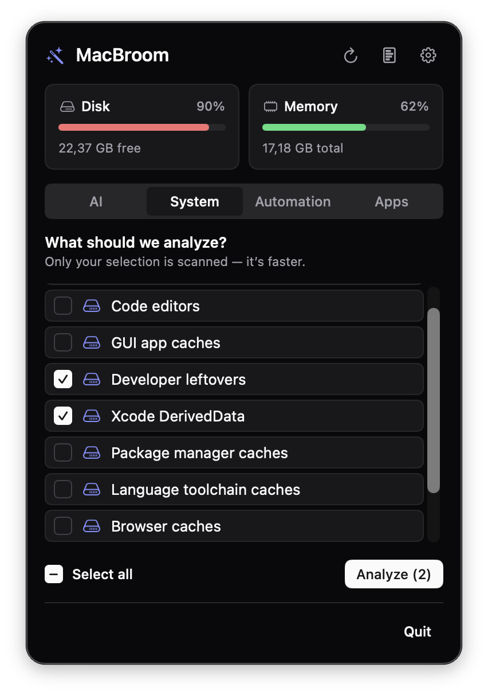
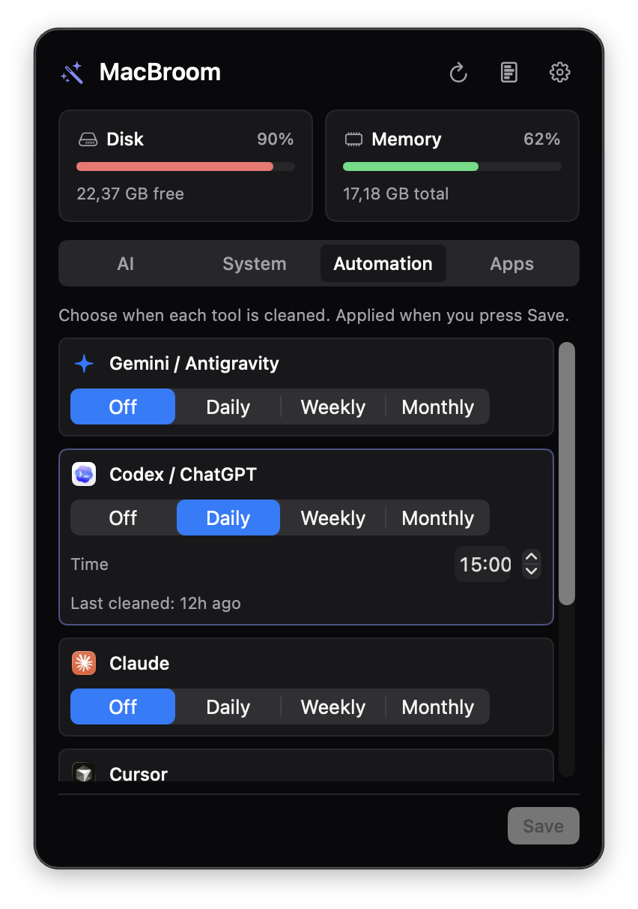
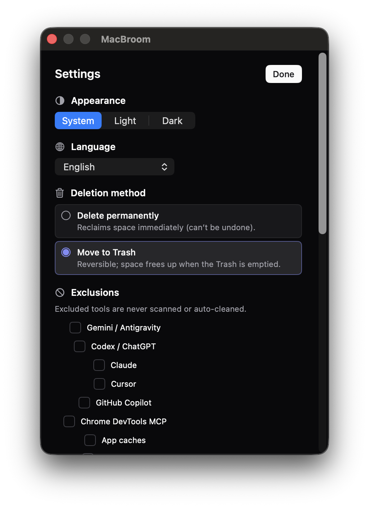

<div align="center">

# 🧹 MacBroom

**A safe, open-source system & AI cache cleaner for the macOS menu bar.**

[](LICENSE)
[](https://www.apple.com/macos/)
[](https://swift.org)
[](https://developer.apple.com/xcode/swiftui/)
[](https://github.com/afatihyavasi/MacBroom/releases)
[](https://github.com/afatihyavasi/MacBroom/stargazers)
[](https://github.com/afatihyavasi/homebrew-tap)

Powered by [`tw93/mole`](https://github.com/tw93/mole) · SwiftUI · GPL-3.0

[Website](https://github.com/afatihyavasi/MacBroom) · Install: `brew install --cask afatihyavasi/tap/macbroom`

</div>

---

## What is it?

MacBroom puts [mole](https://github.com/tw93/mole)'s safety-first cleaning engine behind a **menu bar app** that follows the Mac design language. No terminal required.

Headline feature: it safely cleans the cache files of AI tools like **Codex, Claude, Gemini, and Cursor** — **without touching** identity, session, or memory data.

## Features

- 🤖 **AI cache cleanup** — Codex / Claude / Gemini / Cursor; state is preserved, only regenerable caches are removed.
- 🧽 **System cache cleanup** — with a dry-run preview and explicit confirmation.
- 📊 **Disk & system status** — live in the menu bar.
- 🗑️ **App uninstaller** — the app plus its leftovers.

## Screenshots

<table>
  <tr>
    <td align="center" width="50%">
      <br>
      <sub><b>AI cache cleanup</b> — Codex, Claude, Gemini, Cursor, Copilot…</sub>
    </td>
    <td align="center" width="50%">
      <br>
      <sub><b>System &amp; developer caches</b> — Xcode, package &amp; language toolchain caches</sub>
    </td>
  </tr>
  <tr>
    <td align="center" width="50%">
      <br>
      <sub><b>Scheduled automation</b> — hourly / daily / weekly / monthly, per tool</sub>
    </td>
    <td align="center" width="50%">
      <br>
      <sub><b>Settings</b> — appearance, language, deletion policy, protected paths</sub>
    </td>
  </tr>
</table>

## Safety

MacBroom never deletes anything without a preview and confirmation. Every deletion passes through mole's `should_protect_path`, whitelist, and path-traversal protections. The auth / sessions / memory / history data of AI tools is **protected by default**. Details: [`docs/SAFETY.md`](docs/SAFETY.md).

## Installation

### Homebrew (recommended)

```bash
brew install --cask afatihyavasi/tap/macbroom
```

### Manual (.dmg)

1. Download the latest `MacBroom-<version>.dmg` from the [Releases](https://github.com/afatihyavasi/MacBroom/releases) page.
2. Open the DMG and **drag MacBroom into Applications**.
3. Launch it — the 🧹 icon appears in your **menu bar** (top-right). MacBroom has no Dock icon.

> **First launch (unsigned builds):** if macOS says *"MacBroom can't be opened because it is from an unidentified developer,"* **right-click the app → Open**, then click **Open** again. You only need to do this once.
>
> Alternatively, run: `xattr -dr com.apple.quarantine /Applications/MacBroom.app`
>
> Notarized releases (signed with an Apple Developer ID) open with no warning.

## Setup (development)

```bash
git clone --recurse-submodules https://github.com/<you>/macbroom.git
cd macbroom
swift build           # the app
bats engine/tests/    # bridge tests
```

> Notarized DMG releases will be available on the Releases page.

## Architecture

```
MacBroom.app (SwiftUI MenuBarExtra)
   │  Process + JSON/NDJSON
engine/macbroom-engine.sh (sources mole's lib)
   │
vendor/mole (git submodule, pinned V1.43.1)
```

Details: [`docs/ARCHITECTURE.md`](docs/ARCHITECTURE.md) · Product requirements: [`PRD.md`](PRD.md).

## License & Attribution

MacBroom is distributed under **GPL-3.0-or-later** because it uses mole's GPL-3.0-licensed `lib/` modules. Thanks to [tw93/mole](https://github.com/tw93/mole) for the cleaning engine and safety design.
